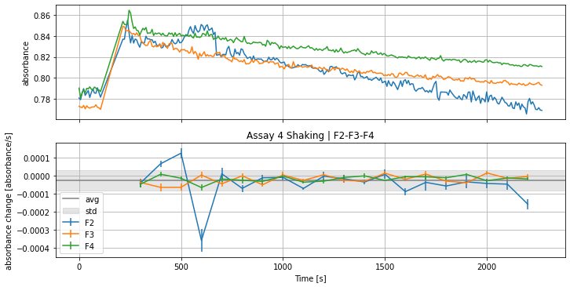
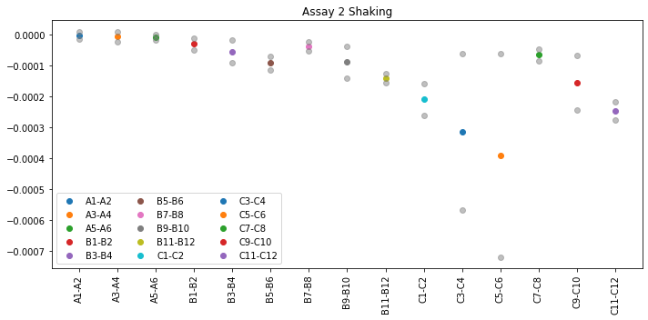
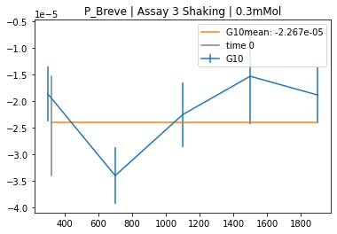
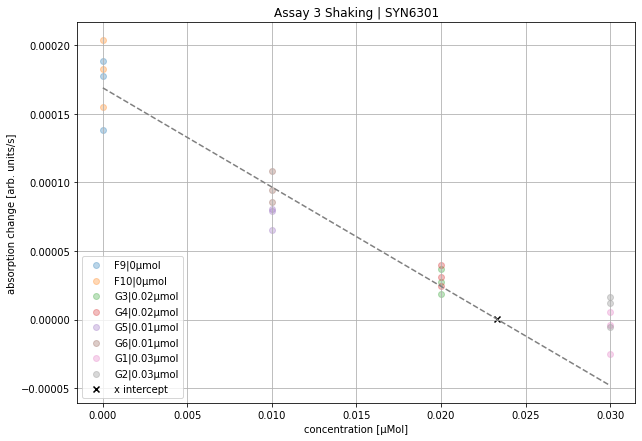
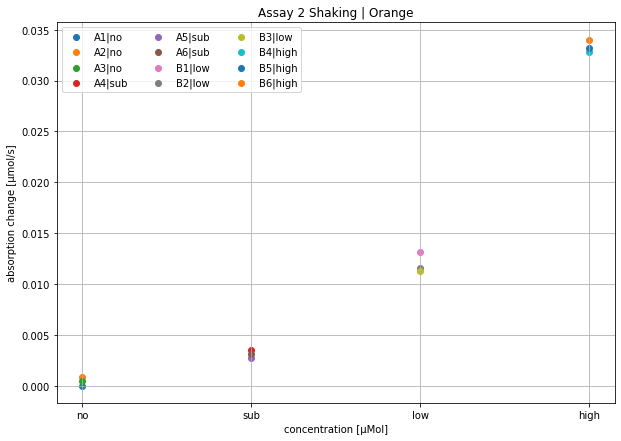

# assaypy 🧑‍🔬🧪🧫

## table of contents

1. [installation](#installation)
2. [data import](#data-import)
3. [grouping](#grouping)
4. [quick look](#quick-look)
5. [CABP data](#cabp-data)
6. [FAQs](#faqs)

## installation

For installation of assaypy use

```python
pip install assaypy
```

One can use cell magic in Jupyter notebook:

```python
%pip install assaypy
```

update to latest version:

```python
pip install assaypy -U
```

install specific version:

```python
pip install assaypy==0.0.2
```

check which versions are installed:

```python
pip freeze | grep assaypy
```

other important modules are: `matplotlib, pprint, pandas, numpy` and `ipywidgets`

## data import

Import data via `path_to_xlsx()` function to locate the excel file, if it can't find the provided excel sheet, the program will open a file browser, where the file can be selected by hand:

```python
assay_run_1 =  path_to_xlsx('tests/testfiles/ 270123 CABP Quant Exp no header.xlsx')
```

Convert the excel sheet into a dictionary of multiple pandas DataFrames for further handling via

```python
dfs = excel_to_pandas(_file: str)-> dict()
```

All metadata and headers are skipped for now. Load all datasheets from the excel file and trim first rows bc of header, can be saved or extracted via another function
trim last 10 rows, to exclude last NaNs.

Now show worksheets of excel sheets and well names:

```python
print_data_structure(dfs)
>> '''data structure with columns found:

Assay 4 Shaking
['D1', 'D2', 'D3', 'D4', 'D5', 'D6', 'D7', 'D8', 'D9', 'D10', 'E1', 'E2', 'E3', 'E4', 'F1', 'F2', 'F3', 'F4', 'F5', 'F6', 'F7', 'F8', 'F9', 'F10', 'F11', 'F12', 'G1', 'G2']
number of columns: 28

Assay 3 Shaking
['A9', 'A10', 'A11', 'A12', 'D1', 'D2', 'D3', 'D4', 'D5', 'D6', 'D7', 'D8', 'D9', 'D10', 'E1', 'E2', 'E3', 'E4', 'E5', 'E6', 'E7', 'E8', 'E9', 'E10', 'E11', 'E12', 'F1', 'F2', 'F3', 'F4', 'F5', 'F6', 'F7', 'F8', 'F9', 'F10', 'F11', 'F12', 'G1', 'G2', 'G3', 'G4', 'G5', 'G6', 'G7', 'G8', 'G9', 'G10', 'G11', 'G12']
number of columns: 50

Assay 2 Shaking
['A1', 'A2', 'A3', 'A4', 'A5', 'A6', 'B1', 'B2', 'B3', 'B4', 'B5', 'B6', 'B7', 'B8', 'B9', 'B10', 'B11', 'B12', 'C1', 'C2', 'C3', 'C4', 'C5', 'C6', 'C7', 'C8', 'C9', 'C10', 'C11', 'C12']
number of columns: 30'''
```

### remove or keep worksheets/assay

```python
keep_assays(dfs1, to_keep = ['Assay 2 Shaking', 'Assay 3 Shaking', 'Assay 4 Shaking'])
remove_assays(dfs1, to_remove=['Assay 2 Shaking','Assay 3 Shaking'])

>>>
'''
Assay 4 Shaking already included
Assay 2 Shaking already removed or not in dict of dataframes.
Assay 3 Shaking already removed or not in dict of dataframes.
'''
```

-> click boxes of assays to remove and proceed:

## grouping

Grouping is important to combine multiple wells into one unit for analysis and first impression. First attach information if an assay or worksheet is measured in duplicate or triplicate via the following function, a prompt will open and one can type in the right information

```python
dubtrip = attach_dubtrip(dfs)
>>'''final:

{'Assay 3 Shaking': 3, 'Assay 4 Shaking': 3}'''
```

Prompt for changing the attached duplicate or triplicate information via

```python
change_assay_dubtrip(dfs, dubtrip)
```

with that information the grouping can be done for all loaded assays or spreadsheets. Two modes are possible at the moment `'A1-A2'` and `'A1-B1'` for combining the wells.

```python
groups = group_wells(dfs, dubtrip, mode = 'A1-A2')
```

`groups` will be saved as simple `dict`s and can be changed manually by adressing the key value pairs.

## quick look

If you don't want to do a whole procedure but are still interested in a quick look, this functions are now helpful for you:

This section requires update to version 0.0.7:

`analyse_all(dfs, interval = 200, time0=True, endtime=1000)`

`time0` if `True` starts slope analysis after reaction starts, guessing the start time of the reaction by the long break with no data aquisation. Instead of giving a boolean you can also give a starting time in seconds.

With the exclude parameter one can exclude e.g. 'Assay 1 No Shaking' e.g. or 3 for exluding all triplicate analysis.

Quick look at all the loaded assays:

```python
slopes, errslo = analyse_all(dfs, interval = 100, time0 = 300, endtime = 2300)

plot_assays_and_slopes(dfs,
                       groups,
                       slopes,
                       errslo,
                       show_average=True,
                       exclude = [],
                       )
```

will result in many plots of all the assays. Showing slopes and derivation with the above defined parameters like that:


Plotting the average slopes of the shown curves above:

```python
plot_slope_values(groups, slopes)
```



The grey points in the plot mark the standard deviation of all averaged slope values from the group.

## CABP data

### attach mol information to CABP assay where n = 2

Input Mol concentration data for each well pair, enzymes can be named, but must be unique per assay.

```python
## CABP Groups:
cabp_mol_groups = {
    'Assay 3 Shaking': {
        'Orange': {
            'E1-E2': 0.0,
            'E3-E4': 0.5,
            'E5-E6': 0.15,
            'E7-E8': 0.1,
            'E9-E10': 0.05,
            },
        'Lime': {
            'E11-E12': 0.0,
            'F1-F2': 0.0625,
            'F3-F4': 0.01875,
            'F5-F6': 0.0125,
            'F7-F8': 0.00625,
        },
        'SYN6301': {
            'F9-F10': 0.0,
            'Y1-Y2': 0.1,
            'G1-G2': 0.03,
            'G3-G4': 0.02,
            'G5-G6': 0.01,
        },
        'P_Breve': {
            'G7-G8': 0.0,
            'G9-G10': 0.3,
            'G11-G12': 0.09,
            'A9-A10': 0.06,
            'A11-A12': 0.03,
        },
    },
}

cabp_mol = apply_to_all_wells(cabp_mol_groups)

pprint.pprint(cabp_mol, sort_dicts=False)

>>>
'''{'Assay 3 Shaking': {'Orange': {'E1': 0,
                                'E2': 0,
                                'E3': 0.5,
                                'E4': 0.5,
                                'E5': 0.15,
                                'E6': 0.15,
                                'E7': 0.1,
                                'E8': 0.1,
                                'E9': 0.05,
                                'E10': 0.05},
                     'Lime': {'E11': 0,
                              'E12': 0,
                              'F1': 0.0625,
                              'F2': 0.0625,
                              'F3': 0.01875,
                              'F4': 0.01875,
                              'F5': 0.0125,
                              'F6': 0.0125,
                              'F7': 0.00625,
                              'F8': 0.00625},
                     'SYN6301': {'F9': 0,
                                 'F10': 0,
                                 'Y1': 0.1,
                                 'Y2': 0.1,
                                 'G1': 0.03,
                                 'G2': 0.03,
                                 'G3': 0.02,
                                 'G4': 0.02,
                                 'G5': 0.01,
                                 'G6': 0.01},
                     'P_Breve': {'G7': 0,
                                 'G8': 0,
                                 'G9': 0.3,
                                 'G10': 0.3,
                                 'G11': 0.09,
                                 'G12': 0.09,
                                 'A9': 0.06,
                                 'A10': 0.06,
                                 'A11': 0.03,
                                 'A12': 0.03}}}
                                 '''
```

### show CABP slopes

```python
cabp_slopes = analyse_slopes(dfs,
                                  groups,
                                  cabp_mol,
                                  slopes,
                                  errslo)
```



```python
plot_cabp_slope_values(cabp_slopes,
                       cabp_mol,
                       plot_all_slopes = True,
                       exclude = [])

>>> '''
    xintercept 0.023333333333333334
    rvalue^2   0.9691002057008142
    baseline  -3.569725048362191e-05
    '''
```



plot_all_slopes = False will plots not the histogram of all collected slope data but only the mean value from previous analysis.

### Math used to derive these values

All slopes are multiplied by $-1$, to get positive values per convention. Knockout concentration is the highest concentration in cabp_mol. The slope values in these wells define the baseline. All other data will be shifted by this value, as it is expected that no kinetic behavior can be observed. All concentration data without the knockout concentration (highest concentration in cabp_mol) will be fitted. The intercept with the x-axis will be plotted (black x) and printed.

## Triplet data

First define groups and the concentration used for the triplets.

```python
trip_samples_groups = {
    'Assay 2 Shaking': {
        'Orange': {
            'A1-A2-A3': 'no',
            'A4-A5-A6': 'sub',
            'B1-B2-B3': 'low',
            'B4-B5-B6': 'high',
            },
        'Lime': {
            'A1-A2-A3': 'no',
            'A4-A5-A6': 'sub',
            'B7-B8-B9': 'low',
            'B10-B11-B12': 'high',
            },
         'Syn6301': {
            'A1-A2-A3': 'no',
            'A4-A5-A6': 'sub',
            'C1-C2-C3': 'low',
            'C4-C5-C6': 'high',
            },
        'P Breve': {
            'A1-A2-A3': 'no',
            'A4-A5-A6': 'sub',
            'C7-C8-C9': 'low',
            'C10-C11-C12': 'high',
            },
        },
}

trip_samples = apply_to_all_wells(trip_samples_groups)

pprint.pprint(trip_samples, sort_dicts=False )

>>> '''
    {'Assay 2 Shaking': {'Orange': {'A1': 'no',
                                'A2': 'no',
                                'A3': 'no',
                                'A4': 'sub',
                                'A5': 'sub',
                                'A6': 'sub',
                                'B1': 'low',
                                'B2': 'low',
                                'B3': 'low',
                                'B4': 'high',
                                'B5': 'high',
                                'B6': 'high'},
                     'Lime': {'A1': 'no',
                              'A2': 'no',
                              'A3': 'no',
                              'A4': 'sub',
                              'A5': 'sub',
                              'A6': 'sub',
                              'B7': 'low',
                              'B8': 'low',
                              'B9': 'low',
                              'B10': 'high',
                              'B11': 'high',
                              'B12': 'high'},
                     'Syn6301': {'A1': 'no',
                                 'A2': 'no',
                                 'A3': 'no',
                                 'A4': 'sub',
                                 'A5': 'sub',
                                 'A6': 'sub',
                                 'C1': 'low',
                                 'C2': 'low',
                                 'C3': 'low',
                                 'C4': 'high',
                                 'C5': 'high',
                                 'C6': 'high'},
                     'P Breve': {'A1': 'no',
                                 'A2': 'no',
                                 'A3': 'no',
                                 'A4': 'sub',
                                 'A5': 'sub',
                                 'A6': 'sub',
                                 'C7': 'low',
                                 'C8': 'low',
                                 'C9': 'low',
                                 'C10': 'high',
                                 'C11': 'high',
                                 'C12': 'high'}}}
                                 '''
```

Extract the slope values from the analysis:

```python
trip_slopes = analyse_slopes(dfs,
                             groups,
                             trip_samples,
                             slopes,
                             errslo)
```

Use `trip_slopes` now to plot all Triplicate slope values:

```python
plot_trip_slope_values(trip_slopes,
                 trip_samples,
                 plot_all_slopes=False,
                 beta = 1365.9,
                 epsilon = 1)

>>>
'''
Assay 2 Shaking | Orange
name, slope [see plot for units], well
no 1.1338438094204758e-05 A1|no
no 0.0008817887227456683 A2|no
no 0.0004580964586821416 A3|no
sub 0.003483942981576311 A4|sub
sub 0.002760309690522675 A5|sub
sub 0.0031411757889796585 A6|sub
low 0.013185095972617841 B1|low
low 0.011575521377669849 B2|low
low 0.01128395516609605 B3|low
high 0.03279805626924136 B4|high
high 0.033197757118762924 B5|high
high 0.03402891656950499 B6|high
'''
```



### Math used to derive these values

Calculate concentration from absorption via `absorption_to_concentration()`:

$$ C(A,\beta,\epsilon) = \frac{A}{\beta \cdot \epsilon} \cdot \frac{1}{2} \cdot 10^6 \text{µmol}$$
where, $\beta$ is a factor to correct measurement in 1/(mol $\cdot$ cm), and $\epsilon$ is molar absorptivity in cm. The factor $\frac{1}{2}$ was used because of two . $10^6$ was used to convert to µmol.

## FAQs

- How do I export the analysis or part of the analysis to Excel sheets?

```python
    export_to_excel(slopes, path='output1.xlsx')
```

- How can I calculate between two different absorption measurement machine?

  - Example from TECAN and Nanodrop:

    $l_T$ = pathlength TECAN

    $l_N$ = pathlength Nanodrop

    $A_T$ = absorbance TECAN

    $A_N$ = absorbance Nanodrop

    $\beta$ = conversion factor between the instruments

    $\beta = \frac{l_T}{l_N} = \frac{A_T}{A_N}$

    A $\rightarrow$ c via $-\beta$ and Lambert-Beer law

- How can I can check the Dataframes?

```python
check_dataframe(dfs)

>>>
        Worksheet name:  Assay 4 Shaking
                Time [s]       CO2 %        O2 %          D1          D2  \
        count   289.000000  289.000000  289.000000  289.000000  289.000000
        mean   1180.511720    4.009689    0.558478    0.885917    0.880507
        std     637.859556    0.054418    0.192586    0.006593    0.005812
        min       0.000000    3.800000    0.400000    0.874300    0.870300
        25%     644.144000    4.000000    0.500000    0.880100    0.875700
        50%    1185.836000    4.000000    0.500000    0.885900    0.880200
        75%    1727.467000    4.000000    0.500000    0.892200    0.885700
        max    2268.915000    4.200000    1.400000    0.898700    0.890600

                    D3          D4          D5          D6
        count  289.000000  289.000000  289.000000  289.000000
        mean     0.699241    0.671796    0.485417    0.530104
        std      0.005114    0.005181    0.003056    0.003243
        min      0.690200    0.663200    0.480200    0.524400
        25%      0.695600    0.667700    0.483000    0.527400
        50%      0.699300    0.671100    0.485100    0.529900
        75%      0.703200    0.676000    0.488000    0.532900
        max      0.711000    0.682700    0.492000    0.536900
        -------------------------------------------
        -------------------------------------------
```

-> Docs for version 0.0.7
